# Lab9Web
### PHP Modular
#### 1. Jalankan XAMPP dan akses http://localhost/phpmyadmin/ untuk membuat database.

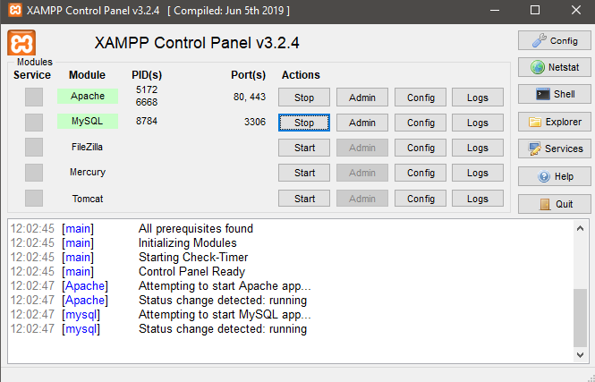

#### 2. Buat file `lab9_php_modular` pada root directory web server c:\xampp\htdocs

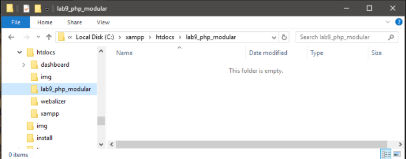

#### 3. Buat file baru dengan nama `header.php` pada folder c:\xampp\htdocs\lab9_php_modular

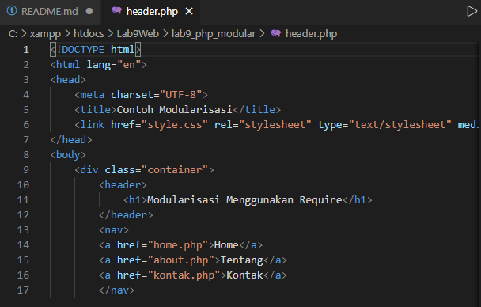

#### 4. Buat file baru dengan nama `footer.php` pada folder c:\xampp\htdocs\lab9_php_modular

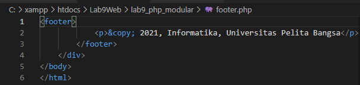

#### 5. Buat file baru dengan nama `home.php` pada folder c:\xampp\htdocs\lab9_php_modular

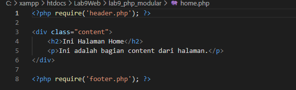

### Hasil Ketika di buka menggunakan link di sammping http://localhost/lab9_php_modular

#### Home

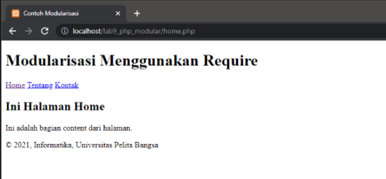

#### About

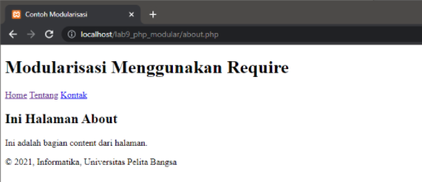

### TUGAS
### Implementasi konsep PHP Modular pada kode program praktikum 8 tentang database, sehingga setiap halamannya memiliki template tampilan yang sama.

### LANGKAH 1
#### 1. Buat file lab9_tugas pada root directory web server c:\xampp\htdocs

#### 2. Buat file baru dengan nama koneksi.php pada folder c:\xampp\htdocs\lab9_tugas

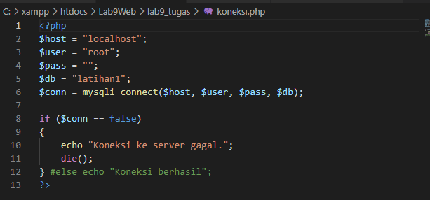

#### 3. Buat file baru dengan nama header.php pada folder c:\xampp\htdocs\lab9_tugas

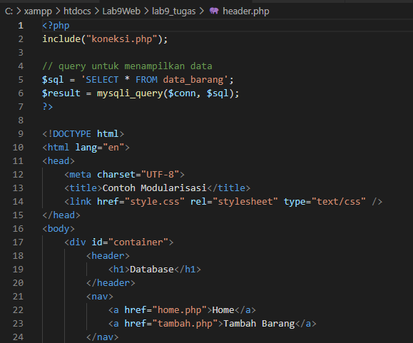

#### 4. Buat file baru dengan nama footer.php pada folder c:\xampp\htdocs\lab9_tugas

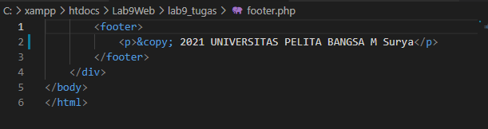

#### 5. Buat file baru dengan nama home.php pada folder c:\xampp\htdocs\lab9_tugas

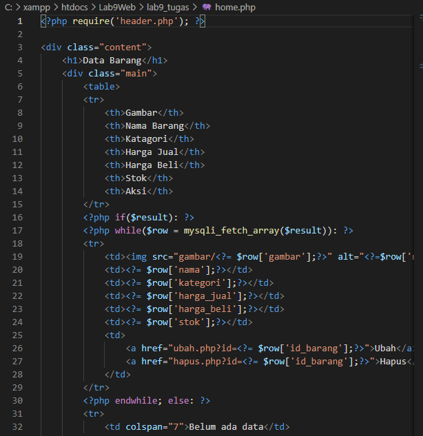
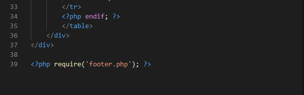

#### 6. Buat file baru dengan nama tambah.php pada folder c:\xampp\htdocs\lab9_tugas

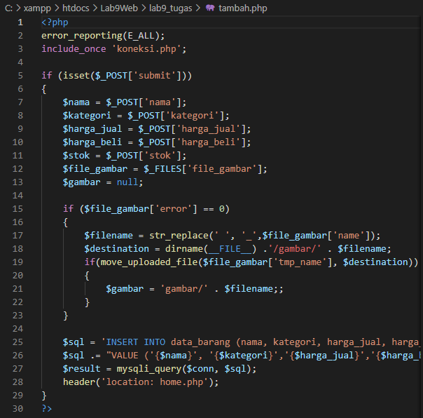
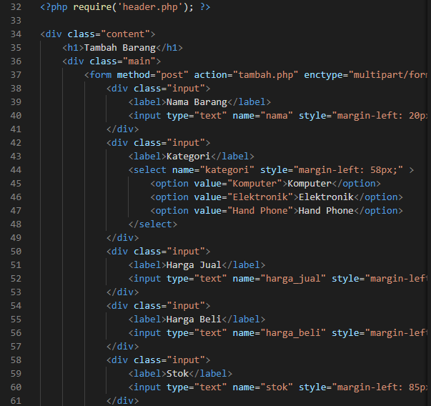
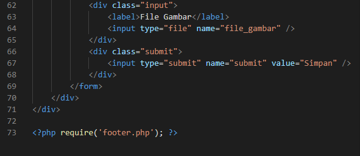

#### 7. Buat file baru dengan nama ubah.php pada folder c:\xampp\htdocs\lab9_tugas

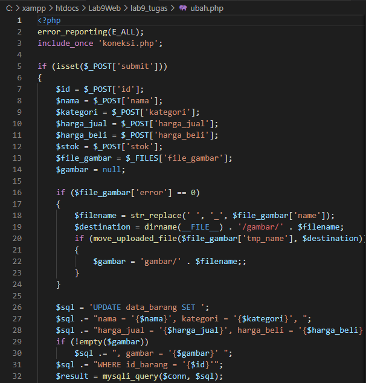
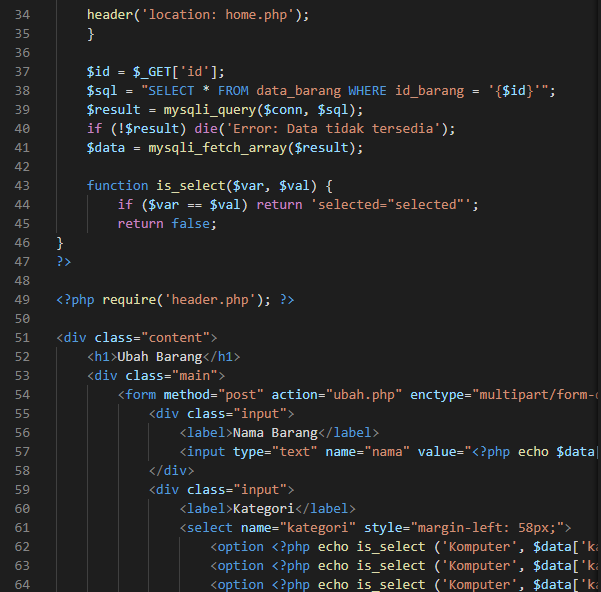
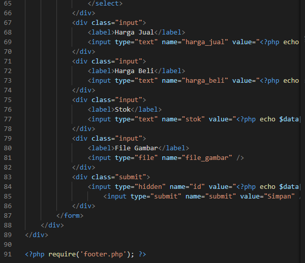

#### 8. Buat file baru dengan nama hapus.php pada folder c:\xampp\htdocs\lab9_tugas

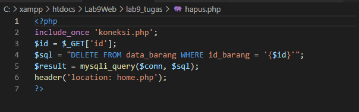

#### 9. Buat file baru dengan nama style.css pada folder c:\xampp\htdocs\lab9_tugas untuk tampilannya

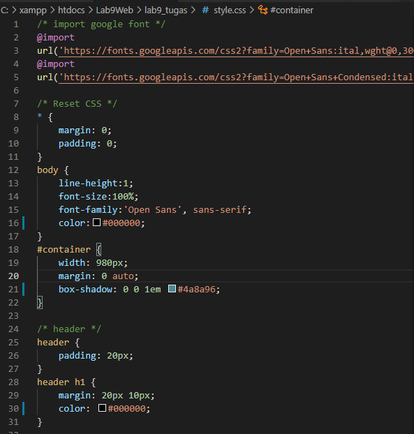
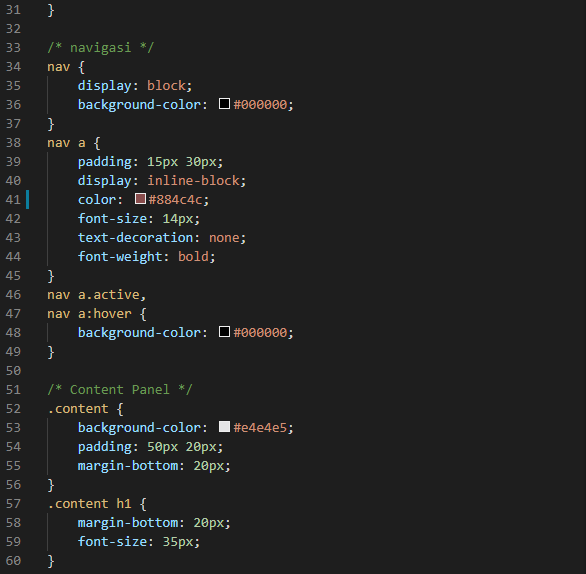
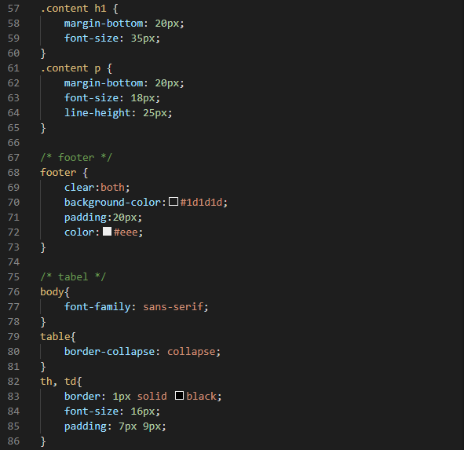
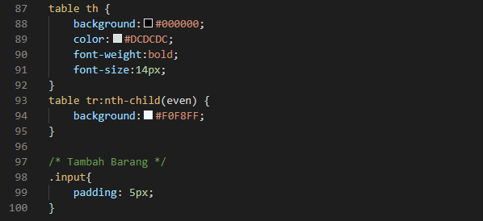

### Hasil Ketika di buka menggunakan link di sammping http://localhost/lab9_tugas

#### Home

#### Tambah
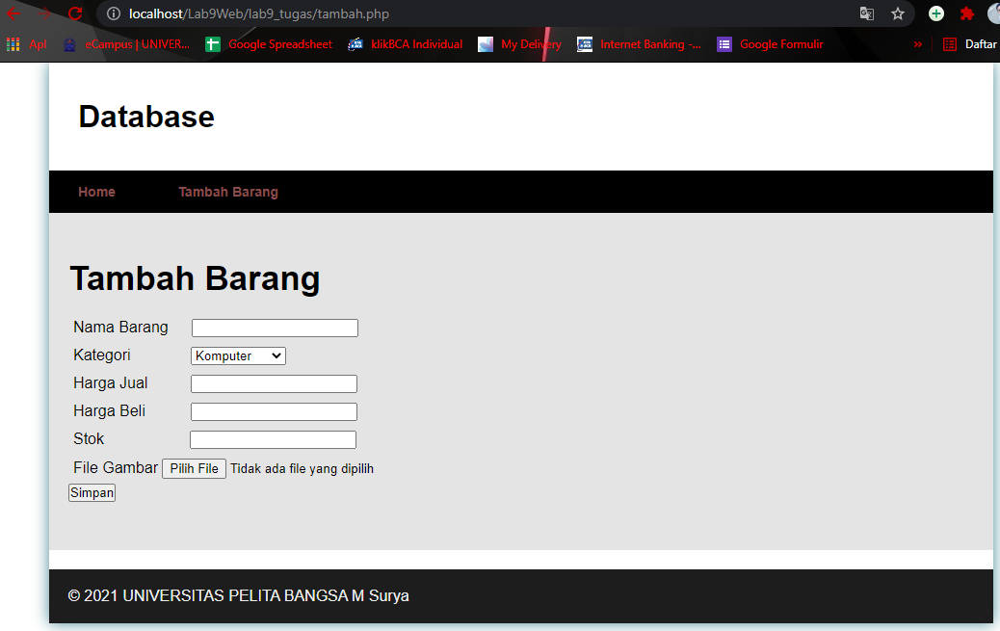

#### Ubah
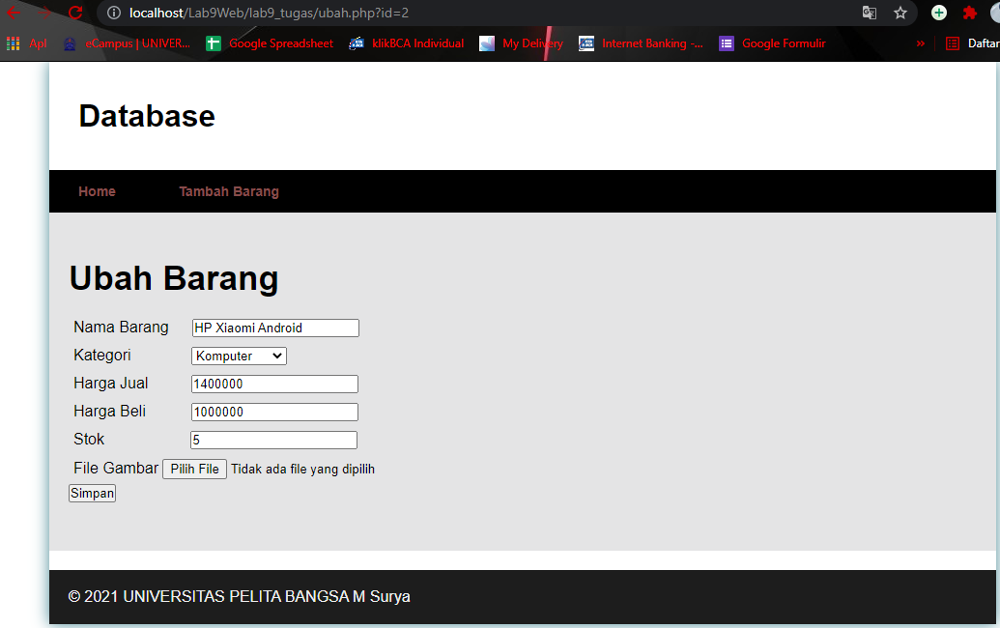
